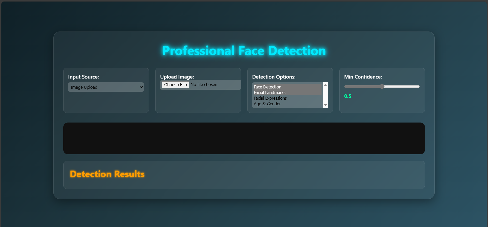

Face Detection Web App using face-api.js

🌐 Live Demo

[Click here to view the live site](https://laiba09saleem.github.io/Task-Manager/)

🖼️ Screenshots



A modern, browser-based **face detection and analysis** web application built with [face-api.js](https://github.com/justadudewhohacks/face-api.js). It supports detecting faces in **uploaded images** as well as **real-time video** (webcam feed), with advanced options for facial landmarks, expressions, age, and gender estimation.

Table of Contents

- [Features](#features)  
- [Demo Preview](#demo-preview)  
- [Technologies](#technologies)  
- [Installation](#installation)  
- [Usage](#usage)  
- [Project Structure](#project-structure)  
- [Configuration](#configuration)  
- [Troubleshooting](#troubleshooting)  
- [Contributing](#contributing)  
- [License](#license)  
- [Contact](#contact)  

Features

- Detect faces from:
  - Uploaded images (PNG, JPG, JPEG)
  - Live webcam video feed  
- Detect and visualize:
  - Face bounding boxes
  - 68-point facial landmarks (eyes, nose, mouth, jawline)
  - Facial expressions (happy, sad, surprised, angry, etc.)
  - Age and gender estimation  
- Adjustable minimum confidence threshold for flexible detection sensitivity.  
- User-selectable detection options to enable/disable features on the fly.  
- Results summary table showing detection confidence, dominant expressions, age, and gender.  
- Lightweight client-side processing using TensorFlow.js and face-api.js — no backend or server processing required.  
- Intuitive and responsive UI supporting both desktop and mobile browsers.

## Technologies

- **face-api.js** — face recognition and detection powered by TensorFlow.js  
- **HTML5 / CSS3 / JavaScript** — frontend UI and logic  
- **MediaDevices API** — access to webcam for real-time video detection  
- Runs entirely client-side — no server dependencies besides hosting static files

---

## Installation

### Prerequisites

- Modern web browser (Chrome, Firefox, Edge, Safari recommended)  
- Local or remote HTTP(S) server to serve files (models won’t load via `file://` protocol)

### Setup Steps

1. **Clone the repository**

```bash
git clone https://github.com/yourusername/face-detection-webapp.git
cd face-detection-webapp
````

2. **Download face-api.js models**

Create a `/models` directory inside the project root. Download the required pre-trained models from the [face-api.js models repository](https://github.com/justadudewhohacks/face-api.js/tree/master/weights) and place them inside `/models`.

Required models include (but are not limited to):

* `tiny_face_detector_model-weights_manifest.json` + binary files
* `face_landmark_68_tiny_model-weights_manifest.json` + binaries
* `face_expression_model-weights_manifest.json` + binaries
* `age_gender_model-weights_manifest.json` + binaries

Alternatively, download the entire weights folder and place it into `/models`.


## Usage

1. Select the input type at the top:

   * **Image** — upload an image file (PNG, JPG, JPEG) for detection
   * **Video** — use your webcam for real-time face detection

2. Adjust detection options:

   * Check/uncheck options to enable detection of landmarks, expressions, and age/gender
   * Adjust the minimum confidence slider to increase/decrease detection sensitivity

3. When using video, click **Start Video** to begin webcam feed and detection, **Stop Video** to end.

4. The app will display face bounding boxes and overlays on the image or video, plus a detailed table with detection info.

Project Structure

face-detection-webapp/
│
├── index.html          # Main HTML file with embedded JavaScript and UI
├── models/             # Pre-trained face-api.js models (weights)
├── README.md           # This documentation file
├── screenshot.png      # Demo screenshot (optional)
└── ...

Configuration

 **Models Folder Path:**
  Ensure the `/models` folder is located at the root relative to `index.html`. If you change the folder name or location, update the `loadModels()` function accordingly.

**Detection Options:**
  Enable/disable detection features in the UI under detection options dropdown.

**Detection Confidence:**
  Adjust the minimum confidence slider to tune detection sensitivity (default 0.5).


Troubleshooting

**Models not loading:**

  * Verify the `/models` folder exists with all required files.
  * Confirm you are running via an HTTP server (not directly opening `index.html` with `file://` protocol).
  * Check browser console for error messages.

**Camera access issues:**

  * Ensure camera permissions are granted in your browser.
  * Test webcam functionality in other applications to rule out hardware issues.

**No detections:**

  * Increase confidence threshold if too high.
  * Verify that the image/video contains visible faces.
  * Check that detection options are properly enabled.

**Performance lag:**

  * Use a device with adequate CPU/GPU.
  * Lower input resolution or disable non-essential detection options.

## Contributing

Contributions, issues, and feature requests are welcome! Feel free to:

* Fork the repository
* Create feature branches
* Submit pull requests with improvements or bug fixes
* Open issues for bugs or suggestions

Please follow best practices and provide clear commit messages.

## Acknowledgements

* [face-api.js](https://github.com/justadudewhohacks/face-api.js) by Vladimir Sementsov
* [TensorFlow.js](https://www.tensorflow.org/js)
* Open source community contributors

## Contact

Created and maintained by **Laiba Saleem**
GitHub: [https://github.com/yourusername](https://github.com/laiba09Saleem)
Email: [your.email@example.com](laibasaleem068@gmail.com)

*Thank you for checking out this project! Feel free to star ⭐ the repo if you find it useful.*

